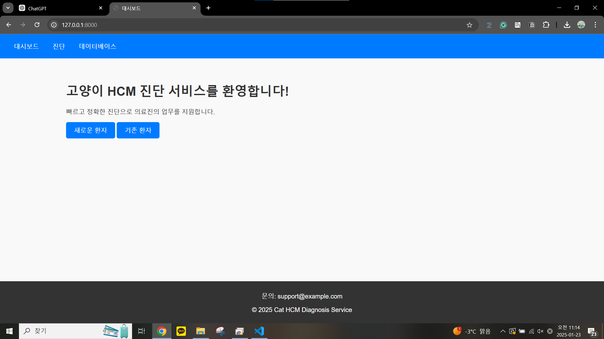
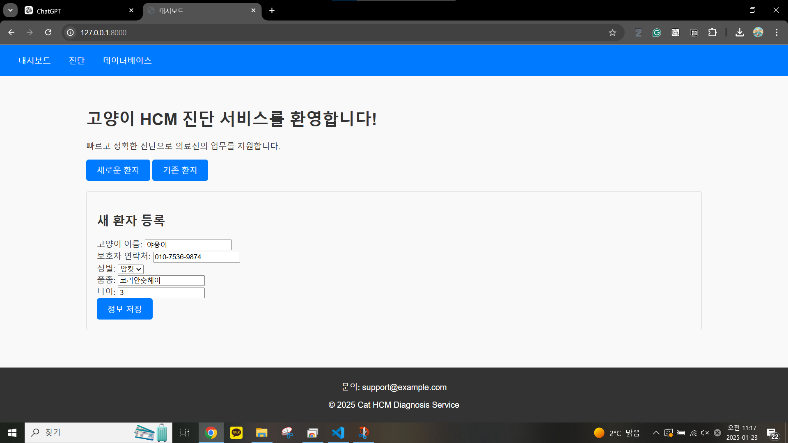
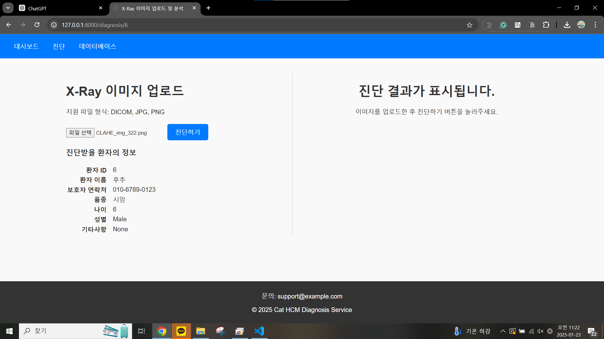
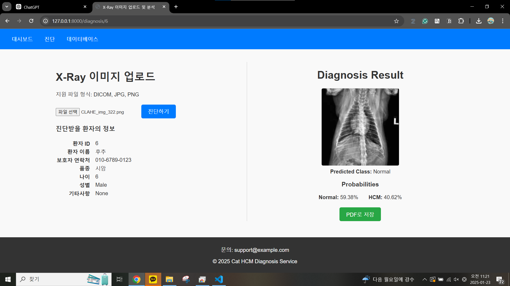
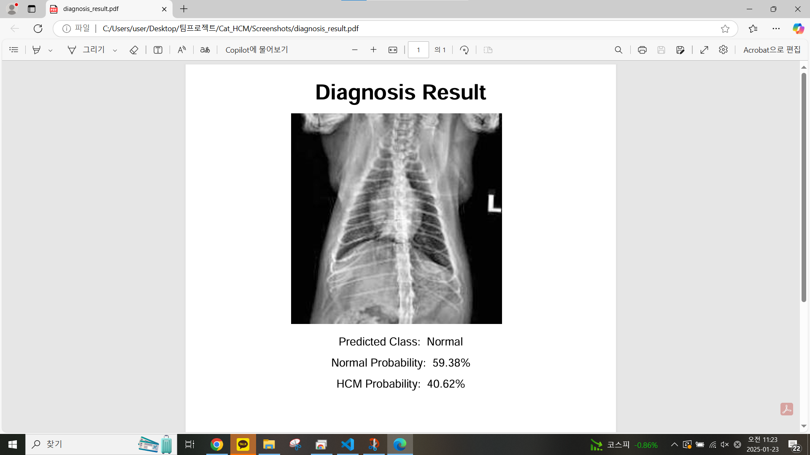

# 🏥 Cat HCM Diagnosis Web Service 🐱💓

고양이의 **비대성 심근병증(HCM)** 진단을 위한 AI 기반 웹 애플리케이션입니다. 
Django를 기반으로 개발되었으며, **InceptionNetV3** 모델을 활용하여 흉부 X-ray 이미지를 분석하고 진단을 수행합니다.
동물병원 의료진의 편의를 고려해 웹 페이지의 **기존환자**와 **신규환자**의 차별적인 워크 플로우를 설계했습니다.

### 🔄 워크플로우
1. **기존환자**: `PatientDB`와 `DiagnosisDB`로 구성된 데이터베이스에서 환자를 선택한 후, 의료 영상을 업로드하여 진단을 진행합니다.  
   → 진단 결과가 자동으로 `DiagnosisDB`에 업데이트됩니다.
2. **신규환자**: 환자 정보를 입력하면 `PatientDB`에 등록되며, 이후 의료 영상을 업로드하여 진단을 진행합니다.  
   → 진단 결과가 자동으로 `DiagnosisDB`에 업데이트됩니다.

### Web page Image
<table>
<tr>
    <td align="center">
        <h3>웹 사이트 초기화면(대시보드)</h3>
        
    </td>
    <td align="center">
        <h3>Voice ID & TTS 입력화면</h3>
        
    </td>
</tr>
<tr>
    <td align="center">
        <h3>Voice ID & TTS 결과화면</h3>
        
    </td>
      <td align="center">
        <h3>Voice ID & TTS 결과화면</h3>
        
    </td>
</tr>
<tr>
    <td align="center">
        <h3>Voice ID & TTS 결과화면</h3>
        
    </td>
      <td align="center">
        <h3>Voice ID & TTS 결과화면</h3>
        
    </td>
</tr>
</table>


<details>
<summary>README (한국어)</summary>

## 🖥️ 프로젝트 개요
이 프로젝트는 **고양이의 HCM 질환을 자동으로 진단**할 수 있는 AI 기반 의료 웹 서비스입니다.

### 🔹 주요 기능
- **X-ray 이미지 업로드** 및 전처리
- **AI 모델(InceptionNetV3) 기반 HCM 진단**
- **진단 결과 저장 및 관리**
- **환자 데이터베이스 구축 및 검색 기능**
- **진단 통계 시각화 (Chart.js 활용)**

## 🛠️ 사용된 기술
- **백엔드**: Django, SQLite
- **프론트엔드**: HTML, CSS, JavaScript, Bootstrap
- **AI 모델**: PyTorch, InceptionNetV3 (전이학습 적용)
- **이미지 처리**: OpenCV, PIL
- **데이터 시각화**: Chart.js, Matplotlib

## 📂 프로젝트 구조
```
Cat_HCM_Diagnosis_Web
│── cat_hcm/                    # Django 프로젝트 폴더
│   ├── settings.py             # Django 설정 파일
│   ├── urls.py                 # URL 라우팅 설정
│   ├── views.py                # 주요 뷰 로직
│   ├── models.py               # 데이터베이스 모델 정의
│   ├── templates/              # HTML 템플릿 폴더
│   ├── static/css/styles.css   # CSS 스타일링
│
│── ai_model/                    # AI 모델 관련 폴더
│   ├── InceptionNet_Inf.py      # InceptionNet 기반 예측 스크립트
│   ├── train_save.py            # AI 모델 학습 및 저장 스크립트
│
│── db.sqlite3                    # SQLite 데이터베이스
│── manage.py                      # Django 실행 파일
```

## 🗄️ 데이터베이스 구조
본 프로젝트에서는 **Django ORM**을 사용하여 환자 정보와 진단 데이터를 저장합니다. 데이터는 **SQLite**를 사용하여 관리됩니다.

### **📌 테이블 1: `PatientDB` (환자 정보)**  
| 필드명         | 데이터 타입   | 설명                         |
|--------------|------------|-----------------------------|
| `cat_id`    | AutoField (PK) | 고유 환자 ID (자동 생성) |
| `owner_phone` | CharField(15) | 보호자 연락처 |
| `cat_name`  | CharField(100) | 고양이 이름 |
| `breed`     | CharField(100) | 품종 |
| `age`       | Integer | 나이 |
| `gender`    | CharField(10) | 성별 (`Male` / `Female`) |
| `remarks`   | TextField (nullable) | 비고란 (추가 정보) |

### **📌 테이블 2: `DiagnosisDB` (진단 기록)**  
| 필드명         | 데이터 타입   | 설명                         |
|--------------|------------|-----------------------------|
| `diagnosis_id` | AutoField (PK) | 진단 기록 ID (자동 생성) |
| `cat_id`    | ForeignKey (PatientDB) | 해당 환자의 ID (`PatientDB` 테이블과 연결) |
| `diagnosis_time` | DateTimeField | 진단이 이루어진 시간 (자동 추가) |
| `diagnosis_result` | CharField(10) | AI 예측 결과 (`Normal` / `HCM`) |
| `diagnosis_image_path` | CharField(255) | 업로드된 X-ray 이미지 경로 |


## 🚀 설치 및 실행 방법
```bash
pip install -r requirements.txt
python manage.py makemigrations
python manage.py migrate
python manage.py runserver
```

브라우저에서 `http://127.0.0.1:8000/`에 접속하세요.

## 📊 기대 효과
✅ **진단 속도 향상**  
✅ **데이터 관리 기능 제공**  
✅ **HCM 조기 발견 지원**  

## 🤝 기여 방법
1. 저장소를 포크(Fork)합니다.
2. 브랜치를 생성하고 변경 사항을 커밋합니다.
3. Pull Request(PR)를 생성합니다.

## 📝 라이선스
이 프로젝트는 **MIT 라이선스** 하에 배포됩니다.

</details>

---

<details>
<summary>README (English)</summary>

## 🖥️ Project Overview
This is an **AI-based web application** for diagnosing **Hypertrophic Cardiomyopathy (HCM) in cats** using chest X-ray images.

## 🔄 Workflow
1. Existing Patients: Select a patient from the `PatientDB` and `DiagnosisDB`, upload a medical image, and proceed with diagnosis.→ The diagnosis result is automatically updated in `DiagnosisDB`.

2. New Patients: Enter patient details to update the `PatientDB`, then upload a medical image for diagnosis.→ The diagnosis result is automatically updated in `DiagnosisDB`.

   
### 🔹 Key Features
- **X-ray Image Upload & Preprocessing**
- **AI Model (InceptionNetV3) for HCM Diagnosis**
- **Diagnosis Result Storage & Management**
- **Patient Database & Search Features**
- **Diagnostic Statistics Visualization (Chart.js)**

## 🛠️ Technologies Used
- **Backend**: Django, SQLite
- **Frontend**: HTML, CSS, JavaScript, Bootstrap
- **AI Model**: PyTorch, InceptionNetV3 (Transfer Learning Applied)
- **Image Processing**: OpenCV, PIL
- **Data Visualization**: Chart.js, Matplotlib

## 📂 Project Structure
```
Cat_HCM_Diagnosis_Web
│── cat_hcm/                    # Django Project Folder
│   ├── settings.py             # Django Settings
│   ├── urls.py                 # URL Routing
│   ├── views.py                # Core Views
│   ├── models.py               # Database Models
│   ├── templates/              # HTML Templates
│   ├── static/css/styles.css   # CSS Styling
│
│── ai_model/                    # AI Model Folder
│   ├── InceptionNet_Inf.py      # InceptionNet Prediction Script
│   ├── train_save.py            # AI Model Training Script
│
│── db.sqlite3                    # SQLite Database
│── manage.py                      # Django Execution File
```

## 🗄️ Database Structure
This project uses **Django ORM** to store patient information and diagnostic data. The data is managed using **SQLite**.

### **📌 Table 1: `PatientDB` (Patient Information)**  
| Field Name   | Data Type   | Description |
|--------------|------------|-------------|
| `cat_id`    | AutoField (PK) | Unique Patient ID (Auto-generated) |
| `owner_phone` | CharField(15) | Owner's Contact Number |
| `cat_name`  | CharField(100) | Cat's Name |
| `breed`     | CharField(100) | Breed |
| `age`       | Integer | Age |
| `gender`    | CharField(10) | Gender (`Male` / `Female`) |
| `remarks`   | TextField (nullable) | Additional Notes |

### **📌 Table 2: `DiagnosisDB` (Diagnosis Records)**  
| Field Name   | Data Type   | Description |
|--------------|------------|-------------|
| `diagnosis_id` | AutoField (PK) | Diagnosis Record ID (Auto-generated) |
| `cat_id`    | ForeignKey (PatientDB) | Related Patient ID (Linked to `PatientDB` Table) |
| `diagnosis_time` | DateTimeField | Timestamp of Diagnosis (Auto-generated) |
| `diagnosis_result` | CharField(10) | AI Prediction Result (`Normal` / `HCM`) |
| `diagnosis_image_path` | CharField(255) | Uploaded X-ray Image Path |


## 🚀 Installation & Execution
```bash
pip install -r requirements.txt
python manage.py makemigrations
python manage.py migrate
python manage.py runserver
```

Access the web application at `http://127.0.0.1:8000/`.

## 📊 Expected Benefits
✅ **Faster Diagnosis with AI**  
✅ **Efficient Data Management**  
✅ **Early Detection of HCM**  

## 🤝 Contribution Guide
1. Fork the repository.
2. Create a new branch and commit your changes.
3. Submit a Pull Request (PR).

## 📝 License
This project is distributed under the **MIT License**.

</details>
